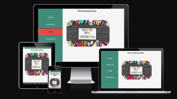

# Welcome to Memory Game 

The project is an interactive Memory Game, created around the "Back to School" theme. The aim of the project is to showcase the knowledge and ability gained on **JavaScript**, **HTML** and **CSS**. 

## How the game works?

The game flashes cards for few seconds on the start and the player has limited moves to finish the game. The player has 3 hints to help throughout all the level (**Caution: to be used sparingly**) and if the player finishes the game, any remaining moves will be carried over to the next level. Any matched pairs will be counted as points and to win the player must match all the cards, otherwise it will result in a loss.

[Picture Flash Memory Game](https://cy-2-30.github.io/Picture_Flash_PP2/)
(Note: Ctrl + click to open in a new tab)

## Table of Contents

1. [Project Goal](#project-goal)
    1. [App Owner Goals](#app-owner-goals)
    2. [User Goals](#user-goals)
2. [User Experience UX](#user-experience-ux)
    1. [Target Audiance](#tarket-audience)
    2. [App Requirements and Expectations](#app-requirements-and-expectactions)
3. [User Stories](#user-stories)
    1. [App Owner Story](#app-owner-story)
    2. [App User Story](#app-user-story)
4. [Technical Design](#technical-design)
    1. [Wireframes](#wireframe)
    2. [Color Scheme](#color-scheme)
    3. [Typograpgy](#typography)
5. [Game Features Design](#game-features-design)
    1. [Home](#home) <!-- test -->  
    2. [About](#about) <!-- test --> 
    3. [Game](#game) <!-- test --> 
    4. [Contact](#contact) <!-- test --> 
6. [Game Manual](#game-manual)
7. [Testing](#testing)
    1. [Code Syntax Testing](#code-syntax-testing) <!-- add content --> 
    2. [Accessibility Testing](#accessibility-testing) <!-- add content --> 
    3. [Responsive Testing](#responsive-testing) <!-- add content --> 
    4. [Performance Testing](#performance-testing) <!-- add content --> 
    5. [Debbuging](#debugging) <!-- add content --> 
8. [Deployment](#deployment)  
    1. [GitHub](#github) 
    2. [Fork Repository](#fork-repository)  
    3. [Clone Repository](#clone-repository)    
9. [Technologies](#technologies)
    1. [Code Languages](#code-languages)
    2. [Frameworks and Libraries](#framework-and-libraries)
    3. [Testing Technologies](#testing-technologies) <!-- add content --> 
10. [Extra Features](#extra-features) <!-- test and add content--> 
11. [Features Not Included](#features-not-included) <!-- test and add content--> 
12. [Credits](#credits)
13. [Acknowledgement](#acknowlegements)

## Project Goal

### App Owner Goals

* The aim of the application, is to create a fun game.
* The aim of the application, is to create a game around a specific theme, for example "Back to School".
* The aim of the application, is to make the pages that are easy and intiutive to navigate.
* The aim of the application, is to give information about the game with brief history, instructions, rules and hints to succed.
* The aim of the application, is to make a game that is stumulating for all players. 
* The aim of the application, is to make all the pages interactive and allow the user to make thier own decision by personalising the experience.
* The aim of the application, is to ensure the user is able to follow outside the application and provide feedback if they wish to do so. 
* The aim of the application, is to make a stumulating game where the user can progress.

### User Goals

* As a user, I want a fun pages to look at.
* As a user, I want to follow the creator oustside the application, provide feedback or ask questions if I wish to do so.
* As a user, I want to have control over the action I choose in the application.
* As a user, I want to easly navigate my way around the application without any difficulty. 
* As a user, I want a game that is stimulating to play.
* As a user, I want to have information about the game, or instruction and rules of the game should I get stuck at any point.
* As a user, the game should be easy to understand from start and yet stimulating to keep me playing.

## User Experience (UX)

### Tarket Audience 

* The game is created for anyone who want to improve thier memory.
* The specific themes would target specific demographics based on the appeal of it. 

### App Requirements and Expectactions

* The application should offer a fun and stumulating game, where the user can progress and be kept entertained throughout the game.
* The user should have control throughout the pages without getting stuck.
* The users and owner should be able to keep connection outside the application, through socials and feedback forms.
* The user and the owner, should be able to give feedback/ask questions and receive feedback/answer questions.

## User Stories

### App Owner Story

* As the owner, I can create connection with the user outside the game tho keep them updated about the latest updates on the application.
* As the owner, I want to receive questions, feedback, suggestions from the user about the application and be able to respond back through socials.
* As the owner, I want the user to stay longer within the pages. 
* As the owner, I want the game to target everyone and bring more user to use the application. 
* As the owner, I want to give control to the user throughout the application.
* As the owner, I want to give all the information about the game to the user before they can even ask any questions.

### App User Story

* As the user, I want to be stumulated throughout the application.
* As the user, I want to be able to communicate with the application owner outside of the application.
* As the user, I want to be informed about the latest changes happening to the application. 
* As the user, I want to use an application that is visually appealing for my eyes.
* As the user, I want to be enertained while I have control over how I navigate the application. 
* As the user, I want to be informed about the game should I get stuck while I am playing or wan to clarify something within the game.
* As the user, I want to use social media to connect with onwer, use navigation to find my way around, use form to ask questions or provide feedback and make decisions in how I play the game. 
* As the user, I want my experience to be personalised.  

[Table of Content](#table-of-content):arrow_up: 

## Technical Design

### Wireframe

The game application uses the bottom-up approach in the styling design. The application is designed for: -
* Any device with 480px and below viewport,
* Any device between 481px to 780px viewport,
* Any device between 781px and 1024px viewport,
* And any device above 1021px viewport.

The pages content will be the same across all the viewports and the difference is in the structure layout depending on the size. The style and design will be the same across all different device’s viewports. 

Click to view the game initial design.

* __Home__ - It is the landing page and is consistent across all viewports
* __About__ - It gives a brief introduction, rules and tips on how to play the game. 
* __Game__ - It is the game page where the player can enter their details, play the game and look at the game statistics. 
* __Contact__ - It is where the user can send feedback or ask any questions about the content of the application.

#### __Mobile__ 

The design is for all viewports below 480px width.

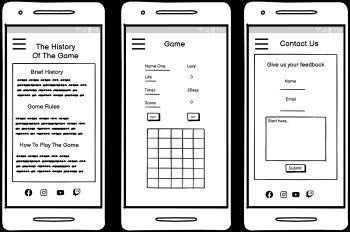

#### __Tablet__

The design is for all viewports between 481px to 780px width.

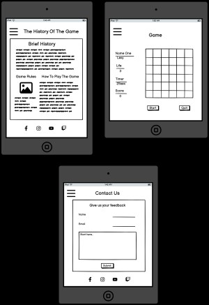

#### __Desktop__ 

The design is for all viewports between 781px and 1024px width.

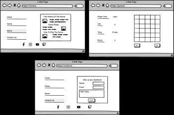

[Table of Content](#table-of-content):arrow_up: 

### Color Scheme 

The colors chosen are to represent back to school theme. The specific colors are chosen based on the stationary and most common uniform/ schools’ colors. 

* __Maize__: #eedf3cff It is used as a highlighter effect on buttons, menu options and game cards.
* __Viridian__: #428b7bff It replaced #eda09cff and used as the main color for the menu, game board and buttons.
* __Vermilion__: #e54a43ff It is used on buttons, forms, menu options and to highlight the social media icons.
* __Outer-Space__: #474747ff It is used to as the footer background color and game cards background.
* __Delft-Blue__: #40406aff It is used to create neomorphism in the buttons, images, game tiles and content cards.
* __White-Smoke__: #f5f5f5ff It is used as the pages background color.
* __Night__: #0a0a0aff It is used as the font color.

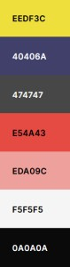

### Typography

The **Happy Monkey** google font will be used along with a default sans serif family. This is used to create an informal look across to align with the back-to-school theme. This also gives the application a more fun look.

## Game Features Design

Click to view the features design.
 

### Mobile 

#### __Home Page__

The landing page has a menu icon on the top-left corner, a back-to-school image in the body with a H1 heading to highlight the game name and at the bottom social media icons. This is the same for all devices up to 780px width.

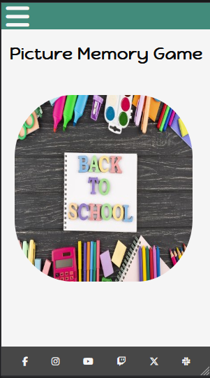

__Menu Icon__

The menu icon dropdown on a click event to display the menu options. This type of menu is only for devices up to 780px width.  

The dropdown menu is highlighted on hover to indicate to the user which option has been selected or is about to be selected. Each menu option leading to a relevant section on the application.  

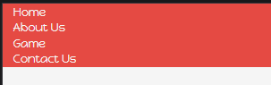

__Footer__

At the bottom of the application there is social media icons. On hover the icons are highlighted to indicate to the user which icon has been selected. Each icon has a click event and on click it will open the relevant link into another window. The icons are displayed in all the app pages and for all the different mobile devices viewports. 

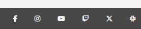

#### __About Page__

The about section displays a brief introduction, rules, instructions and tips about the game. Each section displays with an image on the top before the content. The structure is only for devices below 480px width.  

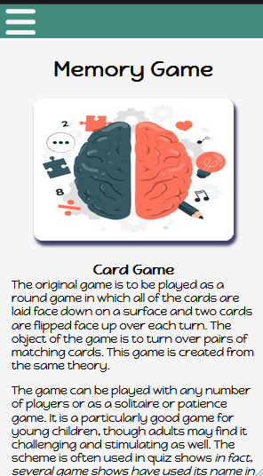

At the bottom of the page the is a back to home button. This is to help the user to navigate. The back to home button displays the menu icon on the top left corner of the viewport. The icon is available for different viewports up to 780px width.

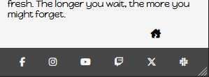

__Contact Page__

At the bottom of the page the is a back to home button. This is to help the user to navigate. The back to home button displays the menu icon on the top left corner of the viewport. The icon is available for different viewports up to 780px width.

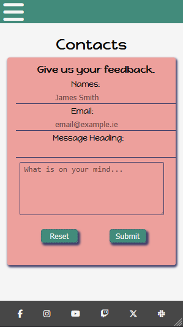

__Game Page__

The content of the game section is divided into different categories and each step leads to another. Each category will display the content of the information with a next button below for the user to navigate to the next category.  First, the user is required to choose what type of game mode they wish to play. The mode selection options offer three different options: -
* To play alone, 
* To play with the computer or 
* To play with another player

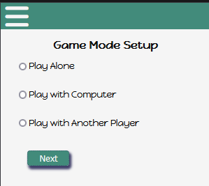

Based on the user option the next step requires the player's name. If it is two players, the names cannot be the same and both players would have to provide two different names.  

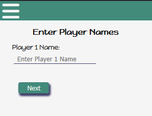

After the name input, the user will be lead to a welcome message if it is sigle player playing. However if it is not an option to choose who will be the first one to play will be displayed. 

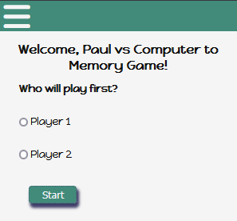

The next category is a welcome message to welcome the players participating in the game. Below the message is the start the game button leading to the game category.  

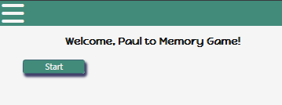

On click of the next button the player is presented with the player’s name on the top to indicate to the user which player turn it is, game statistics, game buttons and gameboard. 

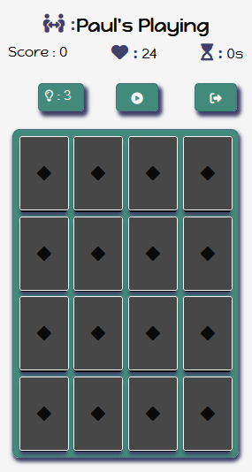

The Heading on the top indicates to the player who is playing and if two players, whose turn it is. 

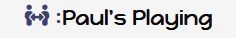

The game statistic consists of: - 
* Scores for the current game
* Available moves for the player
* Timer to count time spent on the game.

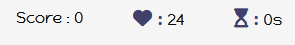

The game buttons consist of three buttons: -
* Hint button for the player to flash cards for hint.
* Play button to start the game. The button also changes to pause button after the game has started.
* The exit button should the player wish to leave the game.

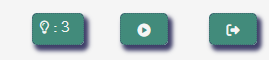

The game board consist of tiles depending on the current player level. Available levels are: - 
* 4x4 tile cards = first level
* 6x6 tile cards = second level
* 8x8 tile cards = third level

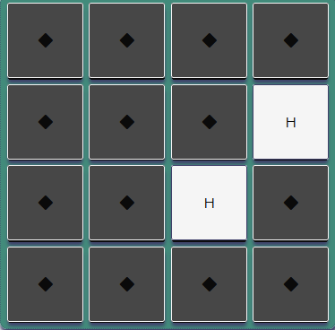

[Table of Content](#table-of-content):arrow_up: 

### Tablet 

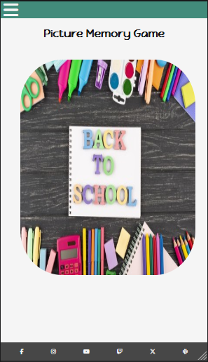

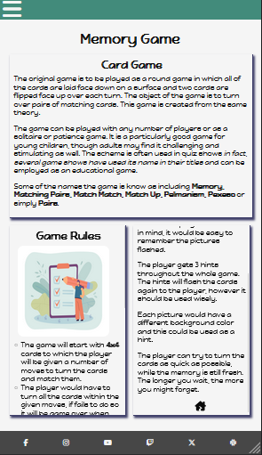

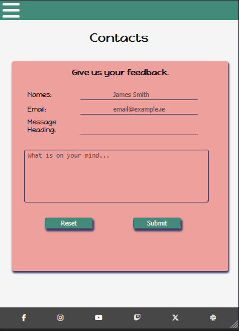

[Table of Content](#table-of-content):arrow_up: 

### Desktop

[Table of Content](#table-of-content):arrow_up:

## Game Manual

Click here to view the instructions manual.

### Player Details

To start the game a player is required to enter a name to be recognised with. The player has an option to choose to play alone, with the computer or with someone. Depending on the choice a name would be required to regnise the player playing. 
Once the player has entered all the details the game board will be displayed. Without the player name the game will not start. 

### Game Information

The game board consist of three sections, the game statistics, game control buttons and the card board. 

#### __Game Statistics__

The statistics include the game score, moves available and timer dor the duration of the game. 

As the player matches the card pairs the score will be added.

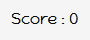

For every move the player make, 1 point will be deducted from the total moves at the start of the game. At the end of the game if the player managed to turn all the cards within allocated moves and still has reminder of moves, the reminder will be accumulated to the next level giving the player a head start for the next level.

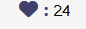

Every time the game start the timer will run and if the game is paused the timer will stop and only resume on the click of play if clicked. 

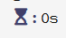

#### __Game Buttons__

The buttons include the hint, play and exit button. 

The player has 3 hints to spread out across three level and use to flash the remainder of the cards and display the values. 

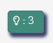

The button is used to start or pause the game.

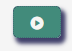

The buttons only displays after the play button has been selected. Without the play button being clicked the button does not display. 

The button stops the game. Once the button is clicked the game cannot be resumed. The button should only be used if the player is sure they want to leave the game. 

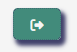

#### __Card Board__

The board consist of cards to be turned on the player's turn. 

#### __Game Logic__

At the press of play button the cards will flash 3 times randomly and the timer will start. After the cards finishing flashing for fec seconds, the player can then start the game. Each game consist of __4x4__ tiles leading to __6x6__ tiles and that lead to the last game __8x8__ tiles. Each level has allocated specific moves based on the tile size. 
A player is meant to turn cards and match a pair to win points. After every turn of two cards, if the cards are not a pair they will be faced down again and only a pair will disappear. The player has 3 hints through out the the whole game, including when the player moves to the next level, until the game ends. On the press of hint button the remaining cards will flash for a few seconds randomly. 

#### __Completion of the game__

On completion of the game:
* __Win__: When the player successfully completes the game by turning all the cards, any ramining moves will be carried to the next level and counted towards the next level game moves. First level is 4x4, second level 6x6 and last level 8x8 tiles. On completion of all the levels the congratulations window will pop up. The window displays the congratulation message, the game statistics with time, score, levels completed and the player name. At the bottom there is navigation buttons, to continue to the next level or to exit and return to home page or to game page mode setup.

* __Lose__: When the player fails to complete the game or leading levels or choose to exit the game, the scoreboard window will appear.  The window displays the a "Try again!" message, the game statistics with time, score, levels completed and the player name, with the navigation buttons. The navigation buttons, has options to try again or to exit and return to home page or to game page mode setup.

[Table of Content](#table-of-content):arrow_up: 

## Deployment 

Click here to view the deployment instruction to GitHub Pages.

### GitHub 

It is a platform for version control and collaboration that lets developers store, manage, and share their code. Built on Git, an open-source version control system, GitHub makes it easier for teams to work on projects together by providing tools to track changes, manage versions, and integrate continuous deployment and collaboration features.

#### __GitHub Account__

A __GitHub__ account would be required to create a reposotory. To open a GitHub account, follow steps would need to be followed:

**Step 1**: Visit [GitHub](https://github.com)
    
    Go to https://github.com

**Step 2**: Start the Sign-Up Process

    On the homepage, click Sign up in the upper-right corner.

**Step 3**: Enter Your Information

    Email Address           : Enter your email address.
    Create a Password       : Choose a strong password for your account.
    Username                : Choose a unique username that will identify you.
    Preferences             : Select whether you want GitHub to send you updates and tips.
    Complete the CAPTCHA    : Complete the verification to prove you’re not a robot.
*Click Create account*

**Step 4**: Confirm your Email Address

    GitHub will send you a verification email. 
    Open your email and click the link to confirm your email address.

**Step 5**: Choose a Plan

    GitHub offers a free plan, as well as paid options with extra features. 
    Select Free to start with, which allows you to create both public and private repositories.

**Step 6**: Set Up Your Profile

    After confirming, you can set up your profile by adding a profile picture, bio, and other details.
*You’re now ready to use GitHub!*

#### __GitHub Pages__

**Step 1**: Sign In to [GitHub](https://github.com)

    Go to https://github.com and log in to your account.

**Step 2**: Start a New Repository

    In the upper-right corner, click the + icon, then select New repository from the dropdown menu.

**Step 3**: Set Up Your Repository

    Repository Name             : Choose a name for your repository.
    Description                 : Add a short description of the project.
    Public or Private           
        Public                  : Anyone can see the repository, but only you can make changes (unless you allow contributors).
        Private                 : Only you and specific collaborators can see and access the repository.
    Initialize Repository       
        Add a README file       : A README.md file is useful for documenting your project.
        Add a .gitignore file   : Choose a .gitignore template based on the project type (e.g., Node, Python) to ignore unnecessary files.
        Choose a License        : If you’re creating an open-source project, select a license to specify usage permissions.

**Step 4**: Add Files and Start Coding

    Now that the repository is created, you can start uploading files, creating new files directly in GitHub, or clone the repository to your local machine to work on it.

__Setup GitHub Pages__

If the repository is public, GitHub Pages allows to host it at no additional cost.

* Steps to set up:
    * Push your code to a GitHub repository (if it’s not there already).
    * Go to your repository’s **Settings**, select **Pages**.
    * Under **Source**, select the branch (often main or master) and the root or /docs folder where your site files are located.
    * Click Save. 
    * GitHub will generate a URL, typically in the format of https://username.github.io/repository-name/, where you can view the application website.

### Fork Repository

Follow the steps to fork the repository:

* Go to the [GitHub](https://github.com/Cy-2-30/pictureflashpp2) repository. 
* Locate the __Fork Button__ on the top-right and click it. 

### Clone Repository

You can clone the repository by following these steps:

* Go to the [GitHub](https://github.com/Cy-2-30/pictureflashpp2) repository. 
* Or you could select __Code__ above the code to clone.
* Select if you prefere to clone using HTTPS, SSH, or Github CLI and click the copy button to copy the URL to your clipboard.
* Open Git Bash.
* Change the current working directory to the one where you want the cloned directory
* Type git clone and paste the URL from the clipboard ($ git clone https://github.com/YOUR-USERNAME/YOUR-REPOSITORY) 
* Press Enter to create your local clone.

[Table of Content](#table-of-content):arrow_up: 

 

### Technologies 

To create this game, a number of technologies has been used to ensure the game functions as expected, has less errors and has consistency accross different viewports. 

#### __Code Languages__

* HTML - Body structure.
* CSS - Design styling.
* Javascript - Game logic and pages interaction.

#### __FrameWork and Libraries__

* [Freepik](https://www.freepik.com/) - All the images used in the pages and game
* [Wireframe Design](https://balsamiq.com) - The game design.
* [Images Resizing App](irfanview.com) - Resizing of the images.
* [Fontawesome Icons](https://fontawesome.com) - Social media icons and game icons.
* [Nekocalc](https://nekocalc.com/px-to-rem-converter) - Converting the px to rem.
* [Coolors.co](https://coolors.co/) - The choosen color theme.
* [Google Fonts](https://fonts.google.com/) - Used for the content font style.

#### __Testing Technologies__

* Final Code Testing:-
    * [HTML Validator](https://validator.w3.org/nu/#textarea)
    * [CSS Validator](https://jigsaw.w3.org/css-validator/#validate_by_input)
    * [JavaScript Validator](https://jshint.com/)
* [Accesibility Checker](https://wave.webaim.org)
* Responsive across multiple viewports:-
    * [Responsive Checker](https://responsivedesignchecker.com)
    * [Responsive Validator](https://ui.dev/amiresponsive)
* Production code error checking:- 
    * [Firefox Web Developer Tools](https://www.mozilla.org)
* Code pipeline and deployment progress:-
    * [GitPod](https://www.gitpod.io)
    * [GitHub](https://github.com/)
* Performance testing:-
    * [Google Lighhouse](https://developer.chrome.com/docs/lighthouse)
    * [Page Speed](https://pagespeed.web.dev)
    * [Web Page Test](https://www.webpagetest.org)

[Table of Content](#table-of-content):arrow_up: 

## Testing 

The application has been tested in a number of ways. The **HTML**, **CSS**, **JavaScript**, design style, accessibility comliance, lighhouse performance and responsiveness of the website.

Click here to view how the game was tested.

### Code Syntax Testing 

### Accessibility Testing

### Responsive Testing 

### Performance Testing

### Debugging

| No.   | Bugs             | Resolution (Yes/No)   | Reason/How?                   |
|-------|-------------------|-----------------------|-------------------------------|
|       |                   |                       |                               |

|       |                   |                       |                               |

|       |                   |                       |                               |

|       |                   |                       |                               |

|       |                   |                       |                               |
|-------|-------------------|-----------------------|-------------------------------|

## Manual Testing

### Testing User Story

| Feature           | Action            | Expected Result           | Actual Result         |
|-------------------|-------------------|---------------------------|-----------------------|

### Testing App Owner 

| Feature           | Action            | Expected Result           | Actual Result         |
|-------------------|-------------------|---------------------------|-----------------------|

[Table of Content](#table-of-content):arrow_up: 

## Features 

Click here to view what the game end features are.

### Changes

* Color replacement 
* The game page statistiics is placed in a horizontal order and players turn addded
* The menu fills the top of the viewport.
* The footer is displayed on the game page

### Extra 

* Images have been included for mobile version on the about page.
* Desktop design for for 1024px width has been designed from all viewports

## Not Included

* 

[Table of Content](#table-of-content):arrow_up: 

## Credits

* Animation interaction inspiration ideas:-
    * [3D turn](https://codepen.io/cy-2-30/pen/KKOXGby)
    * [Cards flash turn](https://codepen.io/rameshnr/pen/ydoWbW)
    * [Cards Sample](https://codepen.io/nerokuraudius/pen/VwBvzgj)
    * [Fireworks](https://codepen.io/hmaw/pen/qBEMLxV?editors=1100)
    * [Sad Falling Faces](https://codepen.io/faridvatani/pen/mdvaoNM)
* Game sample ideas:-
    * [Memory Card Game](https://www.youtube.com/watch?v=xWdkt6KSirw):- The repository can be found [here](https://github.com/javascriptacademy-stash/memory-card-game).
    * [Images Memory Game](https://www.youtube.com/watch?v=-tlb4tv4mC4):- The repository can be found[here](https://github.com/developedbyed/memory-game).
* Buttons ideas:-
    * [Buttons](https://codepen.io/yuhomyan/pen/OJMejWJ)

[Table of Content](#table-of-content):arrow_up: 

## Acknowlegements
* [Stackoverflow](https://stackoverflow.com)
* [Code Pen](https://codepen.io)
* [Mozilla Dev](https://developer.mozilla.org)
* [W3School](https://www.w3schools.com)
* [Code Cademy](https://www.codecademy.com)

[Table of Content](#table-of-content):arrow_up: 